# 시연 시나리오

## 시연 목적
- 상황·장소 기반 팝송 추천 → 표현 학습 → 3종 집중 학습(빈칸·스피킹·딕테이션)까지의 전체 플로우 확인
- 플레이리스트, 스트릭, 포인트 등 부가 기능 시연

 

## 시연 환경
- 배포 URL: https://j13c104.p.ssafy.io/
- 브라우저: Chrome 최신 버전 권장
- 해상도: 1920x1080 (Full HD)

 

## 시연용 계정 준비
- 아이디: inttype96@gmail.com
- 비밀번호: qwer1234

 

## 시연 플로우
### 1. 추천 조건 설정 & 추천 결과 확인

1-1. 상황·장소 기반 추천

1-1-1. 추천 페이지에서 상황·장소 선택
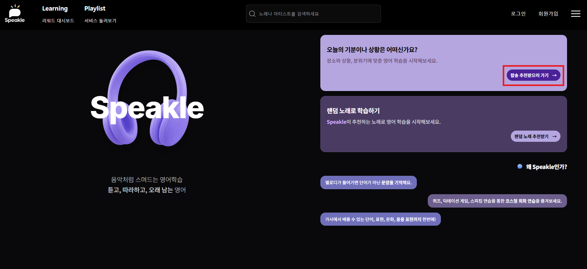

 

1-1-2. 랜덤 추천

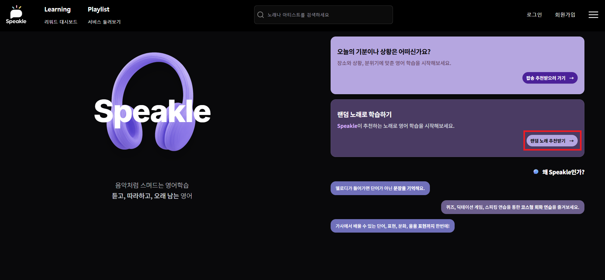

 

1-1-3. 검색으로 팝송 선택 : 곡명/아티스트 검색
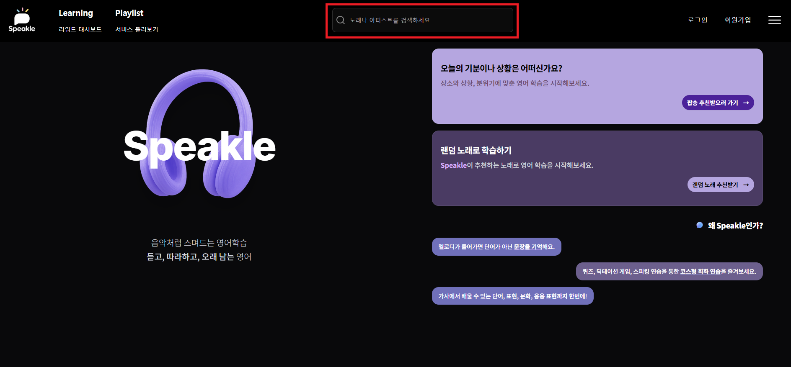

 

### 2. 곡 상세 학습
2-1. 곡 재생

2-2. 타임 싱크 가사 확인

2-3. 유용한 단어, 문장, 표현, 관용구 학습
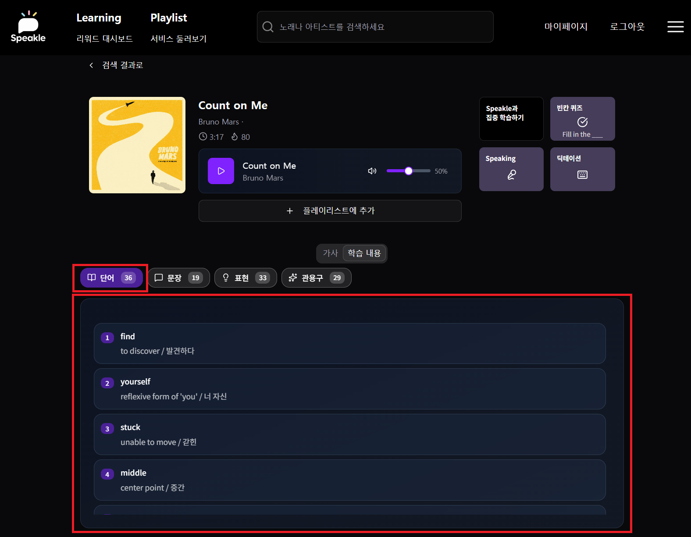
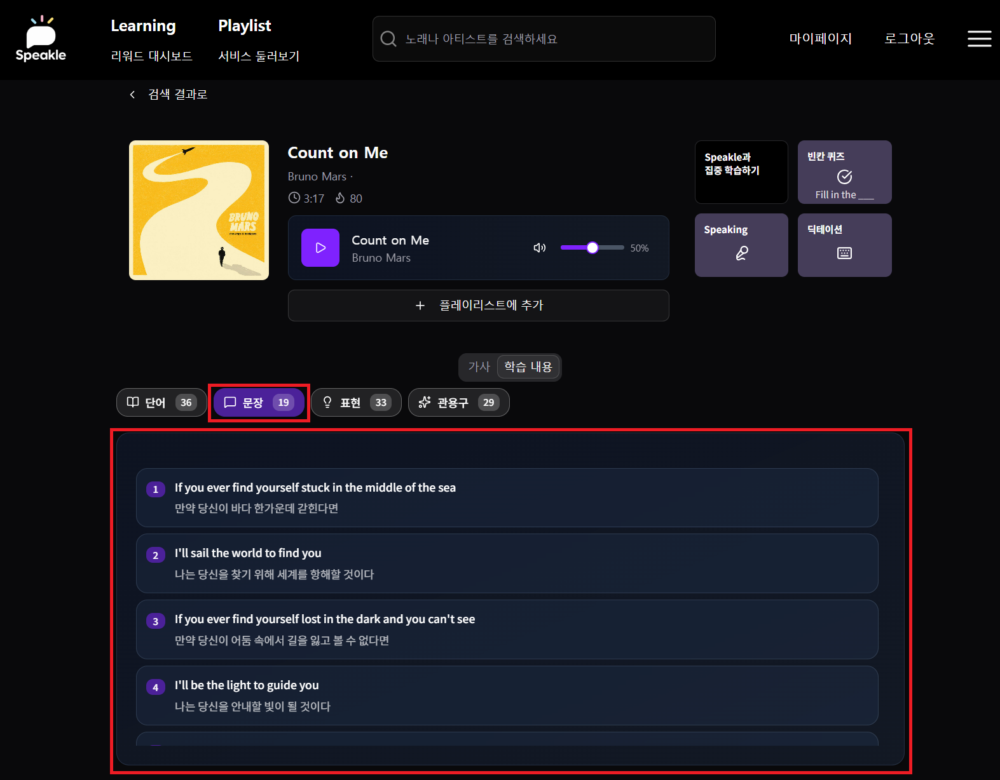

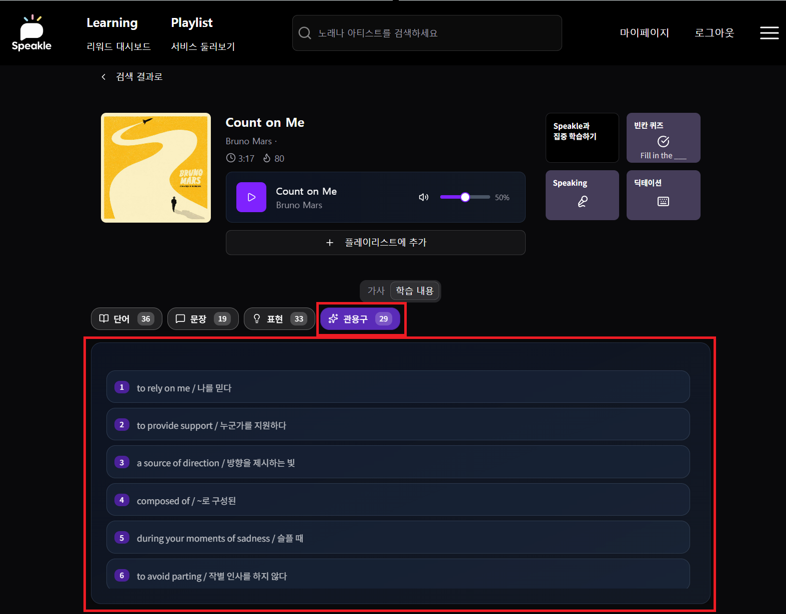

2-4. 집중 학습

2-4-1. 빈칸 퀴즈
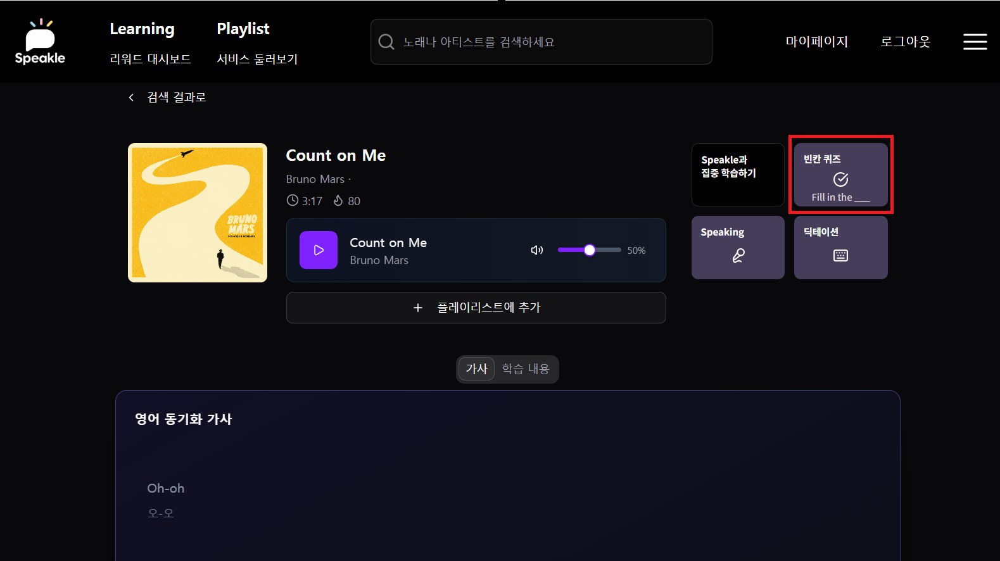
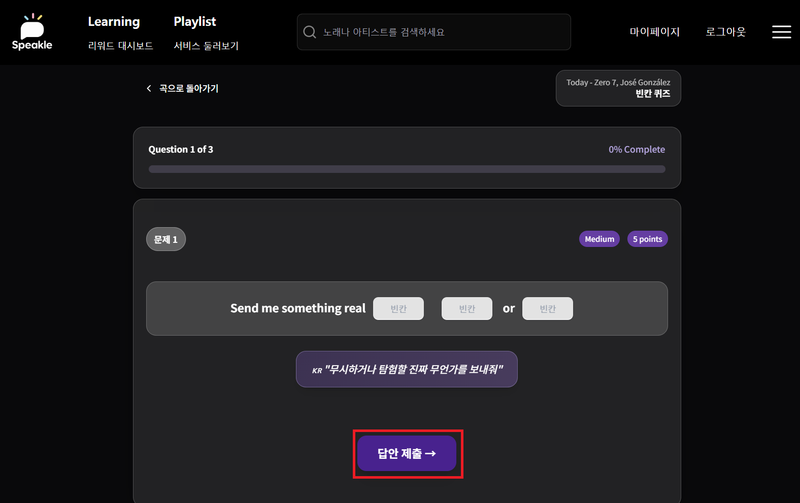

2-4-2. 스피킹 테스트 
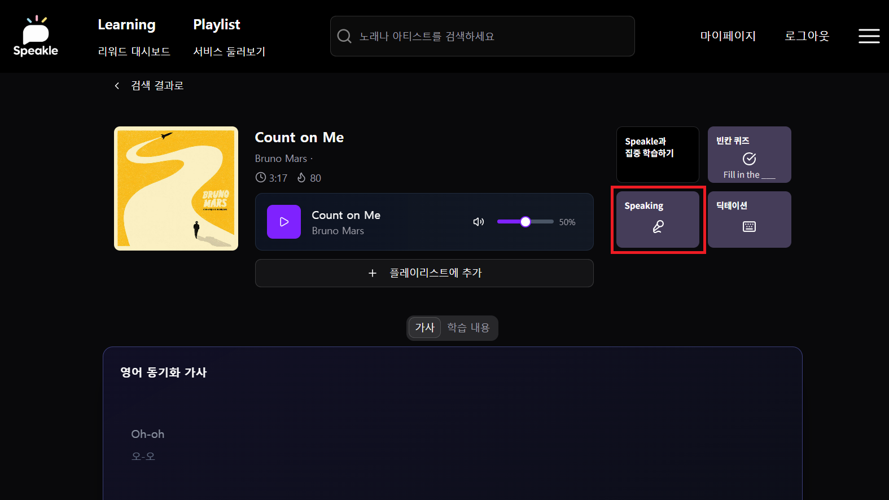
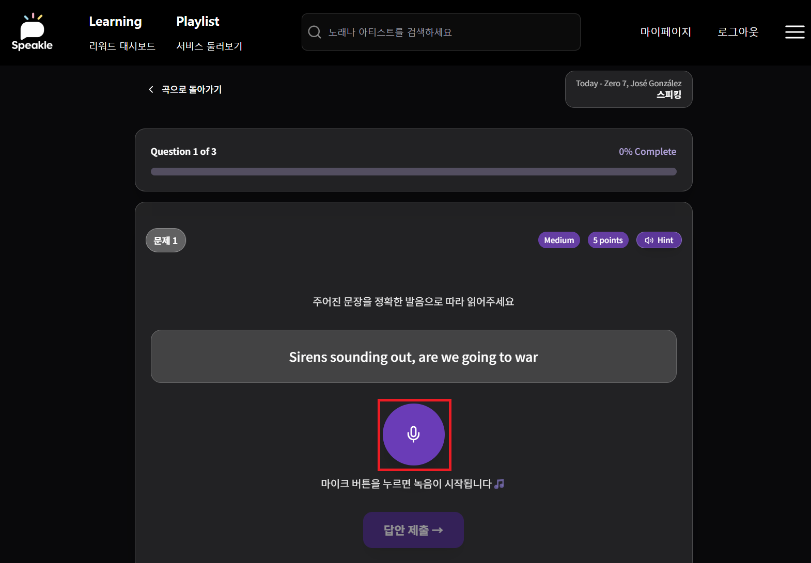

2-4-3. 딕테이션 퀴즈
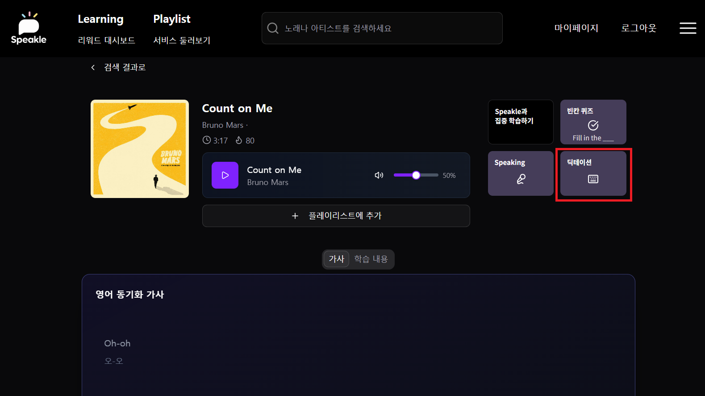

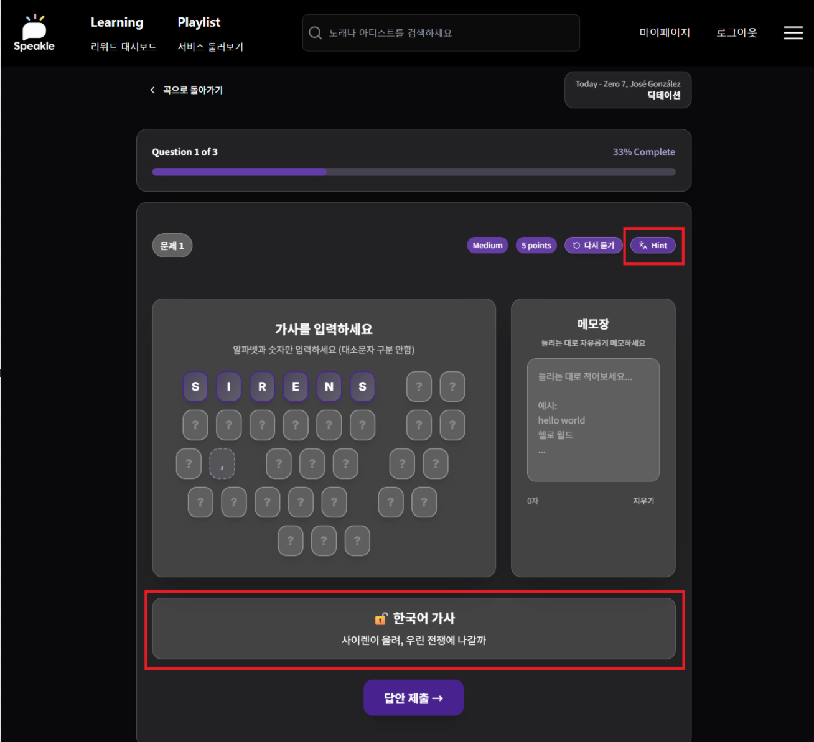

 

### 3. 플레이리스트
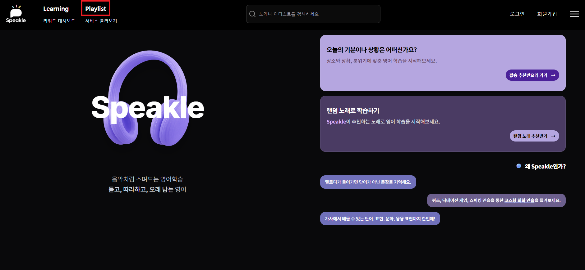
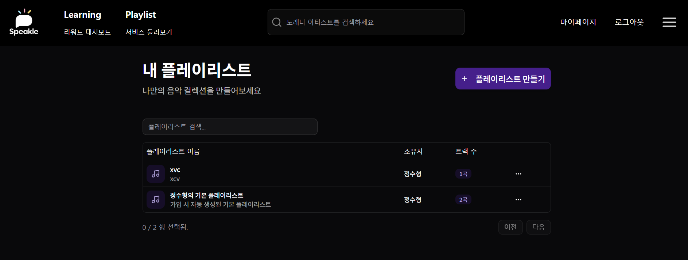

 

### 4. 대시보드 (스트릭, 포인트)

 